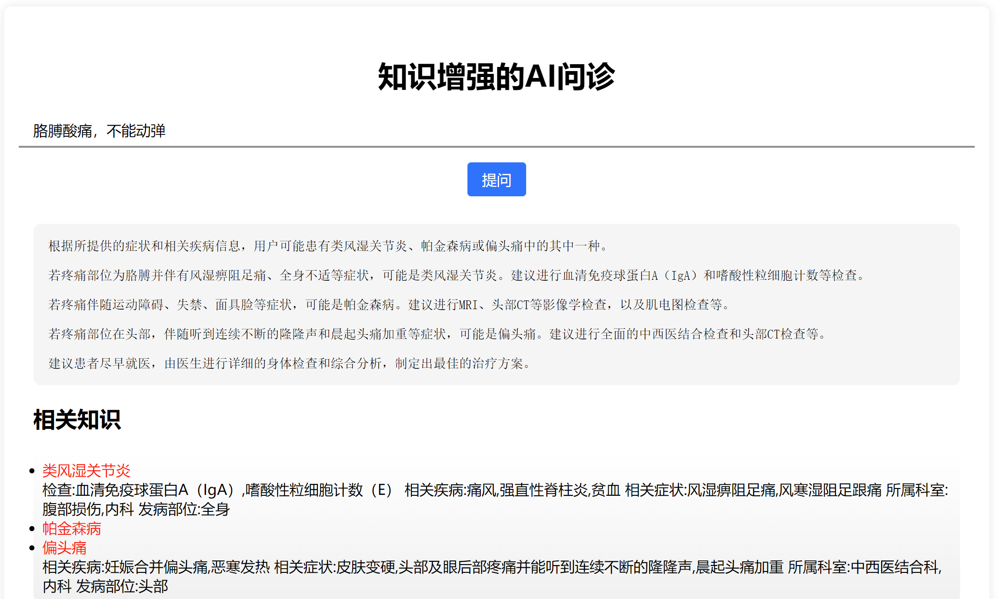

# 知识增强的chatgpt
这个项目是为了给ChatGPT加入外部知识，已经加入的是医学知识

为了保持轻量和可拓展性，不用Llama Index等库，而是采用Sbert直接对知识进行编码，对知识进行编码检索的过程可以轻易定制

### 项目流程
1. 根据输入检索相关医学知识
2. prompt改造
3. chatgpt生成回复

## 快速上手
### 准备工作
安装环境
```
pip install -r requirements.txt
```
设置api key
```
修改./chat.py中第7行"Your_Openai_API_KEY"，替换为你的openai的api key
```
### 运行项目
```
python main.py
```
启动如下图所示的网页，对用户输入会先检索相关知识，然后给ChatGPT做参考


### 定制知识库
如果想换成自己的知识库，需要替换掉```./knowledge_base/disease.txt```，这个文件中每一行文本是一条知识

然后运行
```
# 需要将vector.py中72行知识库名字改成你的新知识库名字
python tools/vector.py
```
执行之后会在知识库同级目录生成向量化之后的文件```***.npy```

然后修改```./tools/vector.py```第65和66行为实际的知识库路径

最后执行
```
python main.py
```

## 交流建议


